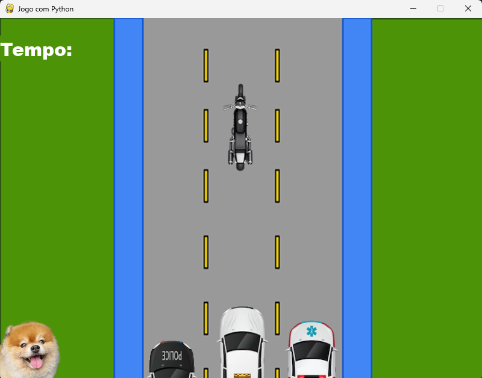
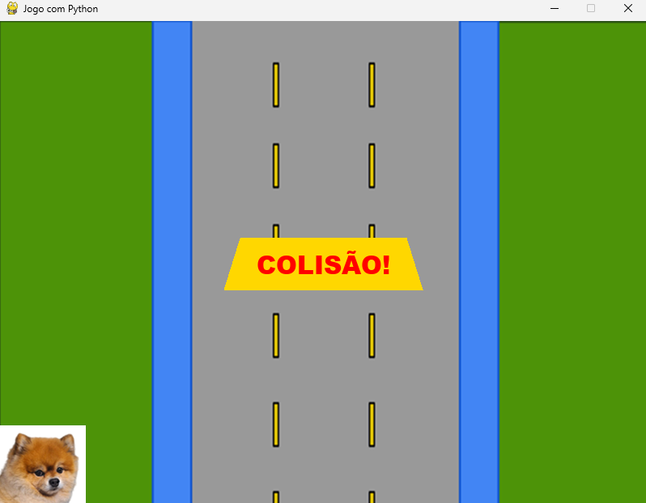

# 🎮 Colisão


---

## 🧩 Sobre o projeto

Este repositório contém uma simulação simples de **colisão entre objetos** em Python.  
O projeto foi feito para treinar lógica, uso de sprites e detecção de colisões.

---

## 🛠 Tecnologias usadas

- Python 3.x  
- Sprites (imagens PNG do repositório)  
- Estruturas básicas de programação  

---

## 📁 Estrutura do repositório

├── Colisao.py # Arquivo principal
├── fundoJogoPythonMini.png # Imagem de fundo
├── motoCustomMini.png # Sprite da moto
├── policia.png # Sprite da polícia
├── foxBGMini.png # Sprite extra
├── foxBGMiniBad.png # Sprite alternativo
├── ambulancia.png # Sprite de ambulância
├── taxi.png # Sprite do táxi
├── tempCodeRunnerFile.py # Arquivo temporário
└── LICENSE # Licença do projeto


---

## 🎯 Funcionalidades

- Exibir objetos em tela  
- Detectar colisão entre objetos  
- Alterar sprites quando há contato  

---

## 🖼 Demonstração

![Exemplo do jogo]
<p align="center">
  
  
</p>

---

## 🚀 Como rodar

1. Clone o repositório:  
   ```bash
   git clone https://github.com/nandoalmeidam/Colisao.git
   cd Colisao
2. Certifique-se de ter o Python instalado (3.x).
3. Execute:
   python Colisao.py


---

📌 Melhorias futuras

* Adicionar interação do jogador (movimento da moto)
* Melhorar lógica de colisão
* Incluir sons e efeitos visuais
* Refatorar para uso de Pygame


---

🏷 Licença

Este projeto está sob a licença GPL-3.0.
Veja o arquivo [LICENSE](LICENSE) para mais detalhes.
